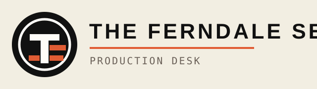
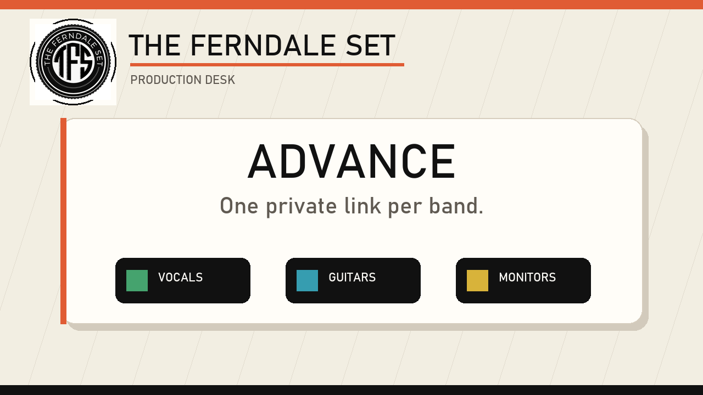

# The Ferndale Set Production Desk

Turn band advances into Behringer X32-ready show files.

The Ferndale Set Production Desk is a local-first production planning app for small venues, backyard concerts, house shows, and DIY audio teams that want the polish of a real advance workflow without dragging a spreadsheet, text thread, and mixer console into a three-way knife fight.

It collects artist input needs, builds a fader plan, maps SD8/X32 routing, tracks gear, prepares monitor and PA outputs, generates run-of-show tasks, and syncs verified scenes to a Behringer X32 over OSC.





## The pitch

Most show prep starts with “just send me what you need” and ends with a messy note, a half-remembered stage plot, and somebody asking for more vocal in a monitor that was never labeled.

This app gives the whole process a home:

- Send each band a private intake link.
- Let musicians list vocals, instruments, DIs, amp mics, and monitor mixes.
- Review the generated channel list before show day.
- Patch physical SD8/X32 inputs and outputs from the workspace.
- Name faders and buses with your color preferences.
- Build conservative starting EQ, gate, and compression.
- Sync one artist, one channel, or a full event into the X32.
- Keep historical setups for returning bands.
- Track cables, mics, stands, DIs, PAs, and shortage risk.
- Work through setup and changeover tasks from a live run-of-show checklist.

It is not trying to mix for you. It is trying to make the boring-but-critical setup work boring in the best possible way.

## Designed for the X32 + SD8 workflow

The app understands the layered routing reality of an X32:

- channel source assignment;
- User In routing;
- physical Local and AES50-A input choices;
- User Out routing;
- OUT staging;
- AES50-A physical stagebox outputs;
- scene save, recall, and validation.

That matters because “CH1 is SD8 input 1” is not one setting on the X32. It is a chain. Production Desk models that chain so you can reason about it from the show plan instead of spelunking through console pages.

## Key features

### Artist intake

Each band gets a dedicated URL for a specific event. They can submit:

- contact details;
- players;
- vocal mic needs;
- multiple instruments per player;
- multiple guitar sources;
- DI vs mic vs line connections;
- monitor mixes;
- notes and oddball requirements.

### Workspace planning

From the workspace you can:

- reorder input channels;
- rename scribble strips;
- set colors and inverted color strips;
- assign physical input sockets;
- edit monitor bus names;
- reorder monitor buses;
- set monitor scribble strip colors;
- patch monitor outputs to SD8 outputs;
- keep Main L/R event-level while monitors remain band-level.

### X32 sync

Sync can target:

- the full event, creating scenes for every band;
- a single artist scene;
- artist channels only;
- one channel only.

Sync jobs run in the background and can be polled for completion so long X32 save/recall operations do not get killed by browser request timeouts.

### Gear inventory

Track what you own and what the show requires:

- XLR cables;
- vocal mics;
- instrument mics;
- DI boxes;
- mic stands;
- PA speakers;
- monitors;
- power and miscellaneous gear.

The event gear planner highlights shortages before load-in and can generate setup checklist items.

### Run of show

Build a practical show-day checklist:

- setup tasks;
- house requirements;
- changeover steps;
- scene recall reminders;
- custom swap notes;
- reorderable and checkable live items.

## Safety philosophy

Production Desk is deliberately conservative:

- starts channels muted;
- starts faders down;
- avoids guessing preamp gain;
- avoids enabling phantom power automatically;
- validates routing and scene writes where possible;
- keeps a simulator mode for development away from the board.

The goal is to save time without surprising the person standing next to the PA.

## Quick start

Install dependencies:

```powershell
pnpm install
```

Run the development app:

```powershell
pnpm dev
```

Open:

```text
http://localhost:5173
```

For a production build:

```powershell
pnpm build
pnpm start
```

## Network use

The API listens on the local network so intake links can be opened from phones, tablets, and laptops on the same Wi-Fi.

When sharing an intake link locally, replace `localhost` with the production computer’s LAN IP address.

Never expose the X32 UDP port `10023` directly to the internet. If you host the web intake publicly, keep the mixer connection private and protected.

## Data storage

Runtime show data is stored locally in:

```text
data/store.json
```

Back this file up with the rest of your production data.

## Tech stack

- Vue 3 frontend
- Node.js / Express backend
- WebSocket live updates
- X32 OSC over UDP
- Local JSON persistence
- pnpm workspace

## Current focus

This app is actively being shaped around real X32/SD8 production use:

- reliable User In / User Out routing;
- monitor buses as editable band outputs;
- scene save/recall validation;
- safe async sync jobs;
- practical show-day workflows over abstract studio concepts.

## Why it exists

Because a great show should not depend on remembering which guitarist texted “actually I have two guitars” at 11:47 PM.

Production Desk turns that chaos into a scene, a checklist, and a console that is ready before the first downbeat.
